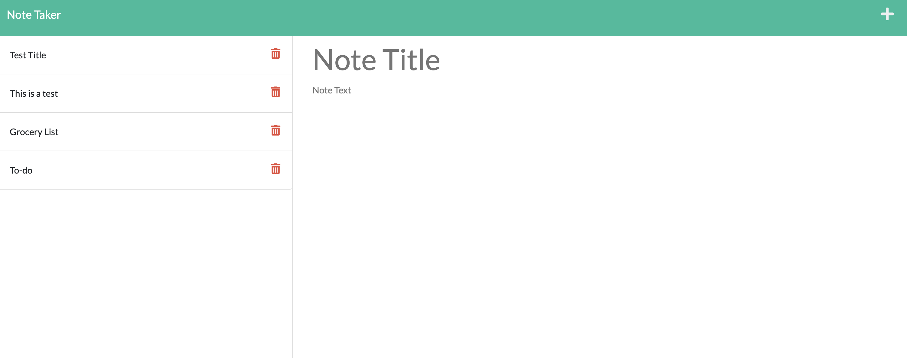

# express.js_note-taker

## Description

This project demonstrates how front-end and back-end development are able to work together using middleware. The purpose was to create an app that allows users to create, save, and delete notes. Starting with a home page, the user is prompeted to push a button and be taken to the notes page. On this notes page the user is able to create a new note by making a note tile, and a note description. After the note is written a save button appears in the top right hand corner of the screen, this button allows the user to save their note and have it appear in the notes list on the left side of the page. A big part of creating this apps functionality was coding the varius routes that allowed the files to comunicate with eachother. I used Express as a dependency in order to create middleware for this app to run between the users request and the apps response. I also used nodemon as a dependency so that the server would continuously update rather than having to restart it after every edit.

## Tech Used

HTML, CSS, Javascript, Node, Express, Bootstrap, and Nodemon

## Deployment Link

https://tasteful-nickel-constellation.glitch.me

## Screenshot 

